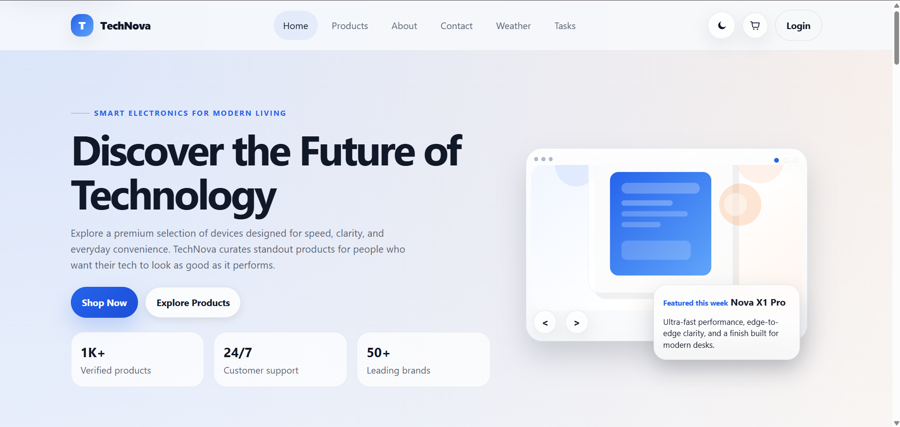
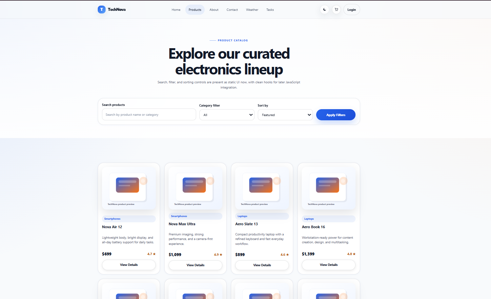
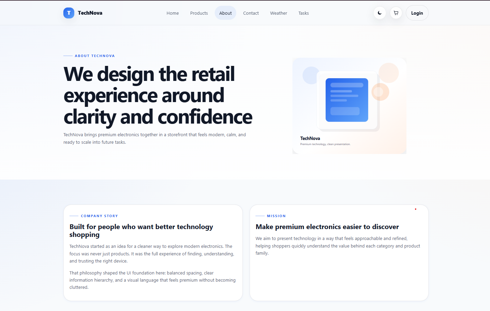
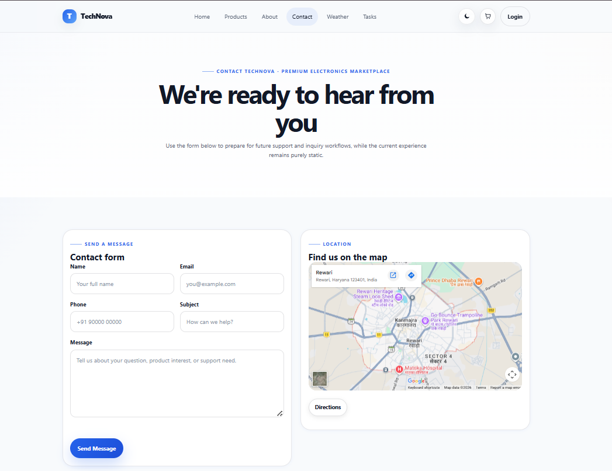
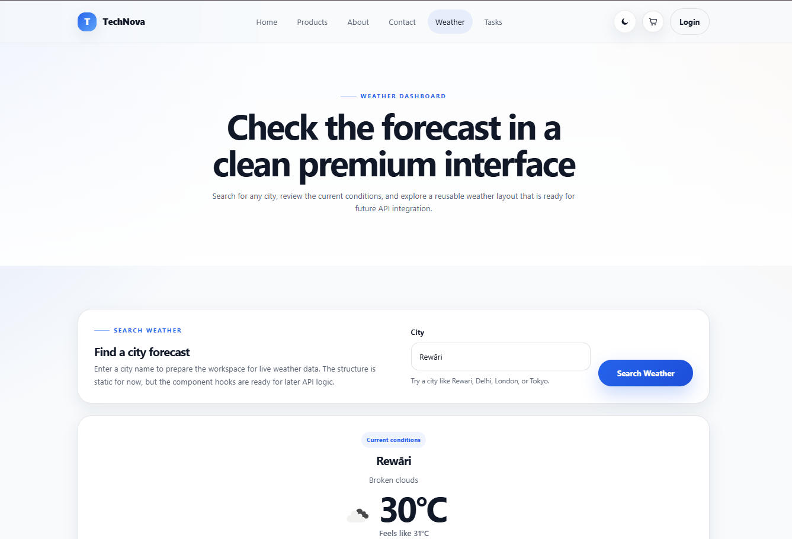
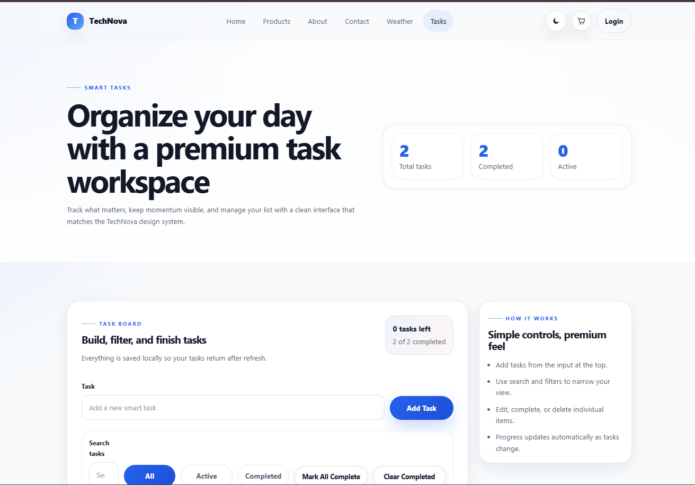
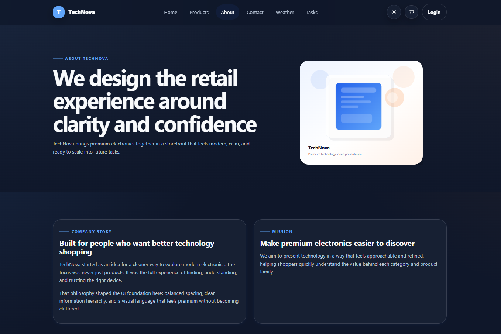
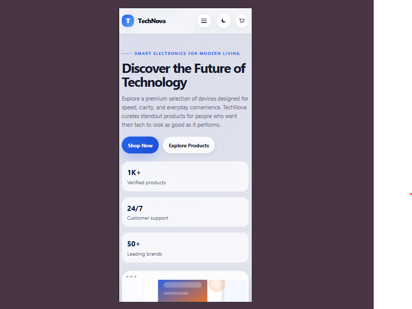

# 🚀 TechNova

A modern, responsive multi-page e-commerce web application built using **HTML5, CSS3, and Vanilla JavaScript (ES6 Modules)** as part of the **ApexPlanet Software Pvt. Ltd. Front-End Development Internship**.

TechNova demonstrates modern front-end development practices through a responsive UI, interactive product browsing, weather integration, task management, dark mode, accessibility improvements, SEO optimization, and performance enhancements.

---

## 🌐 Live Demo

**Live Website:** `<https://technovatask.netlify.app/>`

**GitHub Repository:** `<https://github.com/anne777-collab/TechNova-Task-5>`

---

# 📌 Project Overview

TechNova is a premium electronics storefront designed to provide an engaging shopping experience while showcasing modern front-end development skills.

The project was developed throughout the internship in multiple phases, gradually adding responsive layouts, interactive JavaScript features, API integration, performance optimization, accessibility improvements, and clean code organization.

---

# ✨ Features

## 🛍️ Product Catalog

* Responsive product listing
* Product search
* Category filtering
* Product sorting
* Product Quick View modal
* Responsive product cards
* Smooth animations

---

## 🌤️ Weather Dashboard

* Search weather by city
* Live weather data using OpenWeather API
* Current temperature
* Feels like temperature
* Humidity
* Wind speed
* Atmospheric pressure
* Visibility
* Sunrise & Sunset
* Weather icons
* Input validation
* Responsive interface

---

## ✅ Todo Manager

* Add tasks
* Edit tasks
* Delete tasks
* Mark tasks as completed
* Search tasks
* Filter (All / Active / Completed)
* Mark all tasks complete
* Clear completed tasks
* Progress tracking
* Local Storage support

---

## 🎨 User Interface

* Fully responsive design
* Mobile-first layout
* Dark & Light mode
* Responsive navigation
* Hero slider
* Interactive animations
* Modern UI components
* Contact form
* About page
* Smooth scrolling

---

## ⚡ Performance Optimization

* Optimized CSS architecture
* Modular JavaScript
* Lazy loading images
* Optimized assets
* Reduced render-blocking resources
* Faster loading time
* Clean DOM structure

---

## 🔍 SEO Optimization

* Optimized page titles
* Meta descriptions
* Meta keywords
* Open Graph tags
* robots.txt
* sitemap.xml
* Semantic HTML
* Favicon support

---

## ♿ Accessibility

* Semantic HTML
* ARIA labels
* Keyboard-friendly navigation
* Image alt text
* Improved accessibility practices

---

## 🧹 Code Quality

* Modular CSS
* ES6 JavaScript Modules
* Reusable utility functions
* BEM naming convention
* Organized folder structure
* Maintainable codebase

---

# 🛠️ Tech Stack

* HTML5
* CSS3
* Vanilla JavaScript (ES6 Modules)
* OpenWeather API
* Local Storage API
* Google Lighthouse

---

# 📂 Project Structure

```text
TechNova/
│
├── assets/
│   └── screenshots/
│
├── css/
│
├── images/
│
├── js/
│
├── index.html
├── products.html
├── about.html
├── contact.html
├── weather.html
├── todo.html
├── robots.txt
├── sitemap.xml
├── .gitignore
└── README.md
```

---

# 📸 Screenshots

| Home                             | Products                             |
| -------------------------------- | ------------------------------------ |
|  |  |

| About                             | Contact                             |
| --------------------------------- | ----------------------------------- |
|  |  |

| Weather                             | Todo                             |
| ----------------------------------- | -------------------------------- |
|  |  |

| Dark Mode                             | Mobile View                        |
| ------------------------------------- | ---------------------------------- |
|  |  |

---

# 🔑 Weather API Setup

Create the following file:

```javascript
js/config.js
```

Add your OpenWeather API key:

```javascript
export const OPENWEATHER_API_KEY = "YOUR_API_KEY";
```

A template file (`config.example.js`) is already included.

---

# ▶️ Getting Started

### Clone the repository

```bash
git clone <YOUR_GITHUB_REPOSITORY_URL>
```

### Navigate to the project

```bash
cd TechNova
```

### Configure the API

Create:

```text
js/config.js
```

Add your OpenWeather API key.

### Run the project

Open the project using **Live Server** in Visual Studio Code.

---

# 📱 Responsive Design

Optimized for:

* Desktop
* Laptop
* Tablet
* Mobile Devices

---

# 📊 Lighthouse Scores

* ✅ Performance: **100**
* ✅ Accessibility: **96**
* ✅ Best Practices: **100**
* ✅ SEO: **100**

---

# 🎯 Internship Objectives Completed

### ✅ Task 1

* Responsive multi-page website
* Modern UI
* Responsive navigation
* Product pages

### ✅ Task 2

* Interactive JavaScript components
* Hero slider
* Product filtering
* Search functionality
* Dark mode

### ✅ Task 3

* Weather Dashboard
* Todo Manager
* API integration
* Local Storage
* Product Quick View

### ✅ Task 4

* Performance Optimization
* SEO Improvements
* Accessibility Enhancements
* Code Refactoring
* CSS & JavaScript Modularization

### ✅ Task 5

* Cross-browser testing
* Documentation
* GitHub deployment
* Live website deployment
* Final project submission

---

# 🔒 Security

The OpenWeather API key is **not committed** to GitHub.

* `config.js` is ignored using `.gitignore`
* `config.example.js` is provided for easy setup

---

# 🚀 Future Enhancements

* User Authentication
* Shopping Cart
* Wishlist
* Product Reviews
* Payment Gateway
* Order Tracking
* Backend Integration
* Admin Dashboard

---

# 👨‍💻 Author

**Sahil**

Front-End Development Internship Project

**ApexPlanet Software Pvt. Ltd.**

Built with ❤️ using **HTML5, CSS3, and Vanilla JavaScript**.
